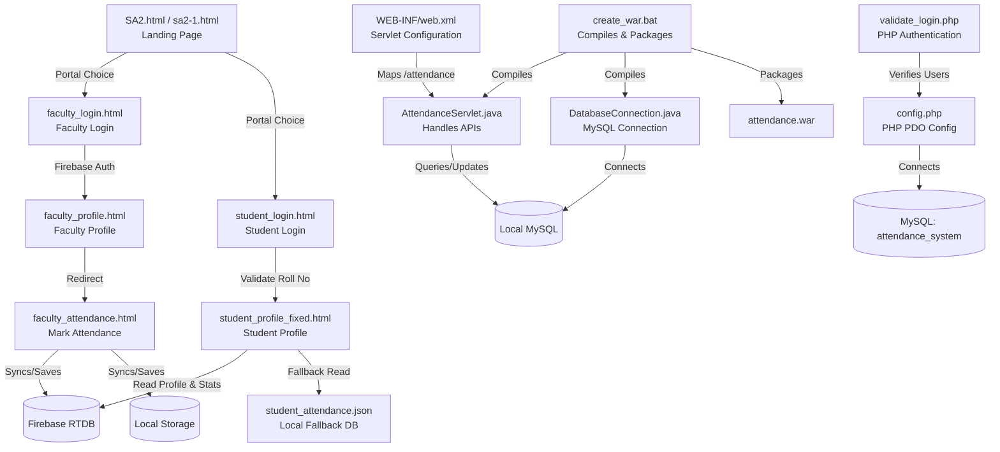
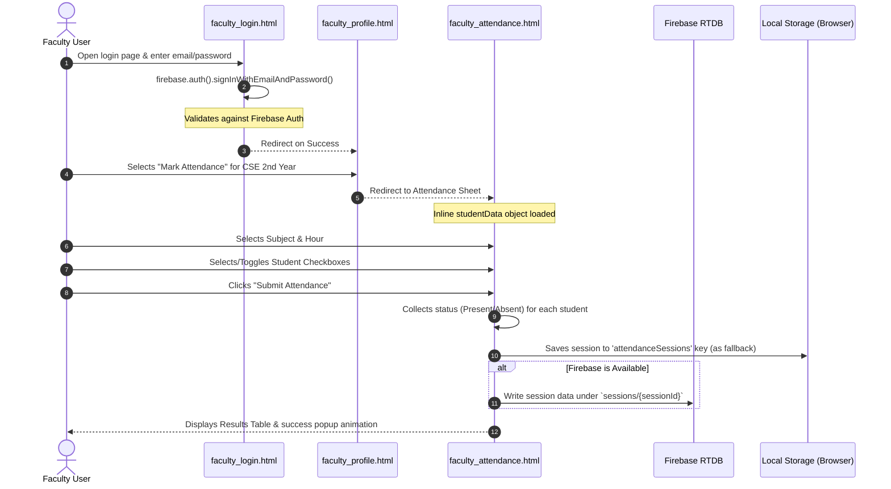
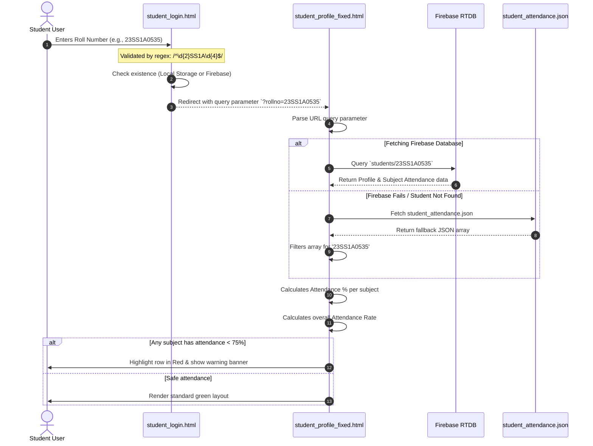

# Attendance Management System: Complete Codebase Workflow Guide

This document provides a comprehensive analysis and flow explanation of the Attendance Management System codebase located in the workspace. It details the system architecture, file dependencies, portal workflows, and database synchronization methods.

---

## 🗺️ Codebase Architecture & File Structure

The project is structured as a Java Web Application that also integrates client-side Firebase operations, a fallback local storage configuration, and PHP login validation scripts.



---

## 🚪 Application Entry Point
* **Primary File**: [SA2.html](file:///c:/Users/venkat%20asrith/OneDrive/Documents/rtrp/SA2/SA2.html) (Alternative theme in [sa2-1.html](file:///c:/Users/venkat%20asrith/OneDrive/Documents/rtrp/SA2/sa2-1.html))
* **Description**: A premium, responsive college portal homepage for JNTUH Sultanpur.
* **Features**:
  * Rich CSS animations, interactive navigation bar, and parallax effects.
  * Direct links to separate portals: **Faculty Portal** and **Student Portal**.

---

## 👨‍🏫 Portal 1: Faculty Workflow

The Faculty Portal allows teachers to authenticate, view their assigned classes, and mark/view student attendance.



### Key Components:
1. **Login Page** ([faculty_login.html](file:///c:/Users/venkat%20asrith/OneDrive/Documents/rtrp/SA2/faculty_login.html)):
   * Uses Firebase Authentication SDK to authorize teachers.
   * Redirects to the Faculty Profile upon authentication.
2. **Faculty Profile** ([faculty_profile.html](file:///c:/Users/venkat%20asrith/OneDrive/Documents/rtrp/SA2/faculty_profile.html)):
   * Displays the teacher's profile (e.g., *Konam Venkat Asrith*).
   * Houses links for specific class years (e.g., CSE 2nd Year, which links to the attendance board).
3. **Attendance Board** ([faculty_attendance.html](file:///c:/Users/venkat%20asrith/OneDrive/Documents/rtrp/SA2/faculty_attendance.html)):
   * **Student Registry**: An inline JavaScript object (`studentData`) mapping roll numbers (from `23SS1A0501` to `23SS1A0560`+) to student names.
   * **Attendance Marking**: Provides quick action buttons (`Mark All Present`, `Mark All Absent`) and subject/hour dropdowns.
   * **Persistence**:
     * Primary storage: Saves session records in `localStorage` under `attendanceSessions`.
     * Cloud storage: Tries to upload to Firebase RTDB under the reference path `/sessions/{sessionId}` asynchronously.
   * **Report Tools**: Leverages the SheetJS library (`xlsx.full.min.js`) to parse client tables and export them directly to `.xlsx` files.

---

## 🎓 Portal 2: Student Workflow

The Student Portal provides students with an interface to check their attendance status and warnings.



### Key Components:
1. **Student Login** ([student_login.html](file:///c:/Users/venkat%20asrith/OneDrive/Documents/rtrp/SA2/student_login.html)):
   * Enforces roll number validation (format: `YYSS1AXXXX`).
   * Validates if the student profile exists in local storage (`students`) or Firebase.
   * Redirects to profile page with query parameters.
2. **Student Profile View** ([student_profile_fixed.html](file:///c:/Users/venkat%20asrith/OneDrive/Documents/rtrp/SA2/student_profile_fixed.html)):
   * Fetches data matching the roll number from the URL parameter.
   * **Double-Fallback System**: Attempts to load from Firebase Database at `/students/{rollno}` first. If unavailable, fetches the local database file `student_attendance.json`.
   * **Detention Warning Engine**: Checks the class percentage for each subject. If a subject's attendance is below 75%, it highlights the subject in red, displays warning badges, and fires a warning alert prompting the student to attend classes.

---

## 🖥️ Back-End Services & Integration Options

The codebase contains two backend integration patterns: a Java Servlet Web Application and a PHP Database layer.

### ☕ Option A: Java Servlet Backend
Used to build a deployable J2EE Web Application (`.war`).

1. **Database Configuration** ([DatabaseConnection.java](file:///c:/Users/venkat%20asrith/OneDrive/Documents/rtrp/SA2/DatabaseConnection.java)):
   * Connects via JDBC to a local MySQL server on port `3306` with database name `FacultyAttendance`.
2. **API Endpoint** ([AttendanceServlet.java](file:///c:/Users/venkat%20asrith/OneDrive/Documents/rtrp/SA2/AttendanceServlet.java)):
   * Maps to `/attendance` via `@WebServlet`.
   * `doGet()`: Returns a JSON object containing all student names and roll numbers fetched from the `Attendance` table.
   * `doPost()`: Processes submission forms. It dynamically updates columns associated with the select `subject` using SQL:
     ```sql
     UPDATE Attendance 
     SET [subject_column] = [subject_column] + ?, 
         TotalHours = TotalHours + ?, 
         TotalClasses = TotalClasses + ? 
     WHERE RollNumber = ?
     ```
     It then recalculates:
     ```sql
     UPDATE Attendance 
     SET AttendancePercentage = (TotalHours * 100.0) / TotalClasses 
     WHERE TotalClasses > 0
     ```
3. **Configuration & Build**:
   * [WEB-INF/web.xml](file:///c:/Users/venkat%20asrith/OneDrive/Documents/rtrp/SA2/WEB-INF/web.xml): Configures servlet paths and sets `faculty_attendance.html` as the default welcome page.
   * [create_war.bat](file:///c:/Users/venkat%20asrith/OneDrive/Documents/rtrp/SA2/create_war.bat): Automation script that compiles java source files and packages HTML, CSS, assets, and libraries into a production-ready `attendance.war` package.

### 🐘 Option B: PHP Backend
Provides traditional server-side scripting features.

1. **Configuration** ([config.php](file:///c:/Users/venkat%20asrith/OneDrive/Documents/rtrp/SA2/config.php)):
   * Connects to a local MySQL instance with database `attendance_system`.
2. **Validation** ([validate_login.php](file:///c:/Users/venkat%20asrith/OneDrive/Documents/rtrp/SA2/validate_login.php)):
   * Verifies usernames and passwords from a `users` MySQL table using PHP `password_verify()`.
   * Returns validation status and user roles (such as admin or faculty) back to the client.

---

> [!NOTE]
> The current system can run fully decoupled from a server backend in **client-side storage fallback mode** (using local browser storage) or be deployed onto standard application servers (such as Apache Tomcat) by packaging it with [create_war.bat](file:///c:/Users/venkat%20asrith/OneDrive/Documents/rtrp/SA2/create_war.bat).
